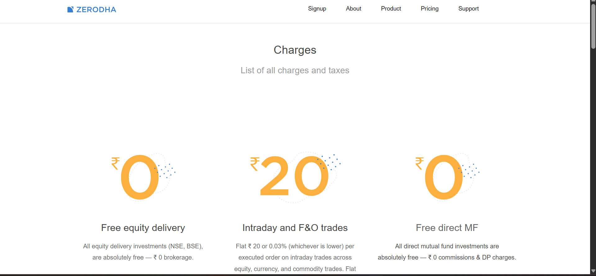

## 🚀 ZERODHA CLONE

Cloning Dashboard and Kite of Zerodha to showcase React skills. Completely based on the MERN stack.

🔵 A modern stock trading UI clone built with React, featuring responsive design and trading-style dashboards.

---

## 📸 Project UI

#### 🏠 Home Page of Dashboard

#### 💰 Pricing Layout

#### 🛟 Support Layout

#### 📈 Kite Interface

#### 📊 Holdings

---

## 🗂 File Structure

---

## 🛠 Tech Stack

### Frontend
- React.js
- Vite / Create React App
- Tailwind CSS / CSS

### Backend
- Node.js
- Express.js

### Database
- MongoDB / Firebase
